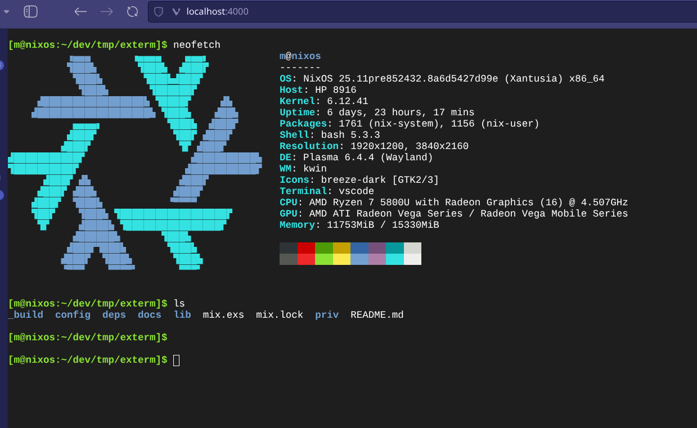

# Elixir Web Terminal

This project is a minimal Elixir application that serves a real terminal in the browser using Plug and Cowboy. It allows users to interact with a shell through a web interface.

## Screenshot



## Project Structure

```
elixir-web-terminal
├── lib
│   ├── web_terminal
│   │   ├── application.ex
│   │   ├── router.ex
│   │   ├── terminal_handler.ex
│   │   └── websocket_handler.ex
│   └── web_terminal.ex
├── priv
│   └── static
│       ├── index.html
│       ├── terminal.css
│       ├── terminal.js
│       ├── xterm.css
│       └── xterm.js
├── config
│   └── config.exs
├── mix.exs
└── README.md
```

## Instructions to Run the Application

1. Fetch the dependencies by running:
   ```
   mix deps.get
   ```

2. Start the application with:
   ```
   mix run --no-halt
   ```

3. Open a web browser and navigate to `http://localhost:4000` to see the working terminal.

## Features

- **WebSocket Communication**: The application uses WebSocket to communicate between the browser and the shell.
- **Terminal Interface**: The terminal is rendered in the browser using xterm.js, providing a responsive and interactive experience.
- **Shell Interaction**: Users can send commands to the shell and receive output in real-time.

## License

This project is open-source and available under the MIT License.